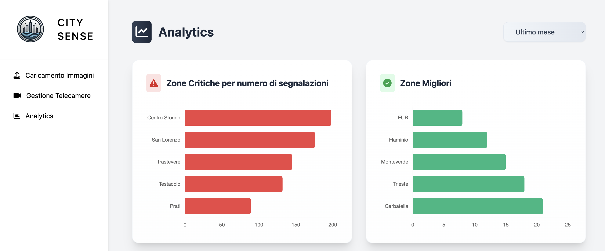

# City Sense Project

## Overview
City Sense è un sistema di monitoraggio urbano che utilizza l'intelligenza artificiale per analizzare le immagini delle telecamere pubbliche e generare report sullo stato della città. Il sistema si concentra su due aspetti principali:
- Monitoraggio rifiuti abbandonati
- Rilevamento buche stradali




## Funzionalità Principali

### 1. Caricamento Immagini
- Interfaccia drag-and-drop per il caricamento delle immagini
- Selezione automatica del quartiere in base alla telecamera
- Sistema di validazione dei file
- Feedback visuale durante il caricamento

### 2. Gestione Telecamere
- Visualizzazione di tutte le telecamere attive
- Organizzazione per quartieri
- Possibilità di esportare report per quartiere
- Interfaccia mappa per la visualizzazione della posizione delle telecamere

### 3. Analytics
- Dashboard con grafici interattivi
- Heatmap per la visualizzazione delle concentrazioni di problemi
- Trend temporali per tipo di segnalazione (rifiuti e buche)
- Report dettagliati per quartiere
- Confronto prestazioni tra zone

## Installazione

1. Clona il repository:
```bash
git clone https://github.com/TroubleMiki01/sense-city-project.git
```

2. Apri il file index.html in un browser web moderno

## Requisiti
- Browser web moderno con supporto JavaScript
- Connessione internet per le mappe e le librerie CDN

## Struttura del Progetto
```
sense-city-project/
├── js/
│   ├── analytics.js   # Gestione grafici e analisi dati
│   ├── cameras.js     # Gestione telecamere e mappa
│   ├── main.js        # Logica principale dell'applicazione
│   └── upload.js      # Gestione upload immagini
├── css/
│   └── styles.css     # Stili dell'applicazione
├── img/
│   ├── logo.svg       # Logo dell'applicazione
│   └── user-avatar.svg # Avatar utente default
└── admin.html         # Pagina principale dell'applicazione
```

## Librerie Utilizzate
- Tailwind CSS per gli stili
- Chart.js per i grafici
- Leaflet.js per le mappe
- Heatmap.js per le heatmap

## API e Webhook
- L'applicazione utilizza webhook di Make.com per l'elaborazione delle immagini
- Integrazione con OpenStreetMap per le mappe

## Utilizzo

### Caricamento Immagini
1. Accedi alla sezione "Caricamento Immagini"
2. Seleziona una data e una telecamera
3. Trascina un'immagine o usa il pulsante di upload
4. Attendi la conferma del caricamento

### Visualizzazione Analytics
1. Accedi alla sezione "Analytics"
2. Usa i filtri temporali per personalizzare la vista
3. Alterna tra visualizzazione grafico e heatmap
4. Esporta i report quando necessario

### Gestione Telecamere
1. Accedi alla sezione "Gestione Telecamere"
2. Visualizza lo stato delle telecamere
3. Esporta i report per quartiere

## Note di Sicurezza
- L'accesso all'applicazione richiede autenticazione
- Le immagini sono processate in modo sicuro
- I dati sensibili sono protetti

## Supporto
Per supporto e segnalazioni di bug, aprire una issue su GitHub.

## Licenza
Questo progetto è sotto licenza MIT. Vedere il file LICENSE per i dettagli.
